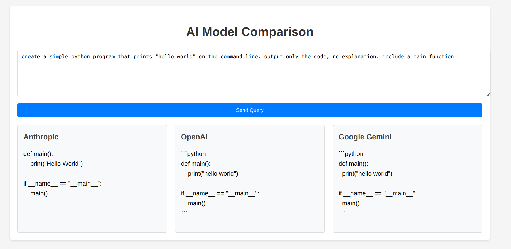

# Sqirvy-AI

**VERSION 0.0.1-alpha**

## What If You Could String Together Some AI Queries To Make Something Happen? And Use A Differet LLM For Each Step? And Do It From The Terminal Instead Of A UI?

Imagine you are setting up some DevOps for a project, and you need a simple way to make queries to LLM providers for use in a command line program. You don't want to have to copypasta from a web app or a python script. Or, you want to automate tasks like code review or web scraping using LLMs. 

How about this: have a set of simple command line programs that perform various fixed queries to LLM providers. You can use them to automate tasks like code review, testing, and deployment. They could be used in CI/CD pipelines, or as part of a devops workflow. And each step could use a different LLM, whatever was suitable for the options.

What if you could chain multiple queries in a shell command or script, and get a single response?

That's what this project is all about.

Here's some of the application programs in this project:

- sqirvy-query:  a command line program that allows you to send arbitrary prompts to an AI model.
- sqirvy-review: a command line program that invokes an AI model to perform code review.
- sqirvy-scrape: a command line program that invokes an AI model to scrape data from the web and perform some action on the downloaded data.

Note: Each LLM model will give different results for a given prompt, and each execution of the same program and prompt will most likely generate different results even with the same model and prompt.

[GitHub Repo](https://github.com/dmh2000/sqirvy-llm)

Sqirvy-llm has some preconfigured command line programs that allow you to send prompts to LLM providers. And it provides a simple API for making queries to LLM providers in Go if you want to use it in your own Go programs.


## Example Scripts

There are several example bash scripts that illustrate the type of actions you can take with the **sqirvy** program:

### Tetris


<pre>
1. use "-f plan" and gemini-1.5-flash to generate a design for a tetris clone
2. use "-f code" and anthropic claude-3-5-sonnet to generate the code based on the design
3. use "-f review" and gpt-4o-mini to perform a code review of the generated code
4. use python to run the program
5. open the web app in the browser
- output files for each step are written to the ./tetris directory
</pre>
```bash
#!/bin/bash

# this script does the following:
# - creates a directory called tetris
# - uses sqirvy-plan and gemini-1.5-flash to create a design for a web app
# - uses sqirvy-code and claude-3-5-sonnet-latest to generate code for the design
# - uses sqirvy-review and gpt-4o-mini to review the code
# - starts a web server to serve the generated code

design="create a design specification for a web project that is a \
    simple web app that implements a simple tetris game clone.       \
    do not generate any code, just describe  what is needed to create the project. \
    code should be html, css and javascript, in a single file named index.html \
    output will be markdown. your output will be to another LLM that will generate the code. "

export BINDIR=../../bin  
make

rm -rf tetris && mkdir tetris 
echo $design | \
$BINDIR/sqirvy -m gemini-1.5-flash         -f plan    | tee tetris/plan.md    | \
$BINDIR/sqirvy -m claude-3-5-sonnet-latest -f code    | tee tetris/index.html | \
$BINDIR/sqirvy -m gpt-4o-mini              -f review  >tetris/review.md   

python -m http.server 8080 --directory tetris
```

## Sqirvy-llm Command Line Programs

### Supported Models

- Supported models:
  - Anthropic
    - claude-3-5-haiku-latest
    - claude-3-5-sonnet-latest
    - claude-3-opus-latest
  - Google Gemini
    - gemini-1.5-flash
    - gemini-1.5-pro
    - gemini-2.0-flash-exp
  - OpenAI
    - gpt-4-turbo
    - gpt-4o
    - gpt-4o-mini
    - o1-mini
  - Meta-Llama
	  - meta-llama/meta-llama-3.1-8b-instruct-turbo
	  - meta-llama/Llama-3.3-70B-Instruct-Turbo
    - meta-llama/Meta-Llama-3.1-405B-Instruct-Turbo

DeepSeek is temporarily disabled due to server overload/DDOS
  - deepseek-reasoner (temporarily disabled due to server overloads)
  - deepseek-chat (also disabled)

### sqirvy-query

- run an arbitrary query to an LLM provider
- concatenates prompt from stdin and/or files and sends it to the specified AI model
- defaults to Anthropic claude-3-5-sonnet-latest model if no model is specified
- example: pipe a prompt to sqirvy-query with the default claude-3-5-sonnet-latest model
  - echo "say hello world" | sqirvy-query
- example: read a prompt from a file and pipe it to sqirvy-query with the o1-mini model
  - sqirvy-query -m o1-mini prompt.txt

A command line program that allows you to send arbitrary prompts to an AI model.

#### Usage: sqirvy-query [options] files...

- Options:
  - -h print this help message
  - -m AI model to use (default: claude-3-5-sonnet-latest)

Example usage:

```bash
sqirvy-query -m gpt-4-turbo-preview "tell me a joke"

sqirvy-query -h
Usage: sqirvy-query [options] files...
initializes the context from stdin, pipe or redirection (if any)
concatenates files to the context in order
Options:
  -h    print this help message
  -m    AI model to use (default: claude-3-5-sonnet-latest)

```

### sqirvy-review

A command line program that invokes an AI model to perform code review. This program has a built-in system and review prompt (using Go file embeddeding), so you don't need to provide any prompts if you don't want to. If you don't like those prompts, you can modify them and rebuild the program.

Example usage:

```bash
sqirvy-review -m claude-3-5-haiku-latest ../../cmd/sqirvy-query/*.go

sqirvy-review -h
Usage: sqirvy-review [options] files...
initializes the context from stdin, pipe or redirection (if any)
concatenates files to the context in order
Options:
  -h    print this help message
  -m    AI model to use (default: gemini-1.5-flash)

```

### sqirvy-scrape

A command line program that invokes an AI model to scrape data from the web and perform some action on the downloaded data.

Example usage:

```bash
sqirvy-scrape -m gpt-4-turbo-preview https://sqirvy.xyz

sqirvy-scrape -h
Usage: sqirvy-scrape [options] urls...
initializes the context from stdin, pipe or redirection (if any)
scrapes content from URLs and sends it to the specified AI model
Options:
  -h     print this help message
  -m     AI model to use (default: claude-3-5-sonnet-latest)

```

### Chaining

The command line programs can be chained together to perform more complex tasks. This is because the prompt inputs to the programs are added to the context in this order:

- special cases
  - sqirvy-review has a built-in system and query prompt.
  - sqirvy_query and sqirvy_scrape, if a file named system.md exists in the current directory, it will be first in the context.
- stdin, pipe or redirection.
- files specified on the command line

For example, you can use sqirvy-scrape to scrape a website and then use sqirvy-query to summarize the content.

```bash
sqirvy-scrape -m gpt-4-turbo-preview https://sqirvy.xyz | sqirvy-query -m gpt-4-turbo-preview "summarize the content"
```

## SDK Library

The above preconfigure commands use the sqirvy-llm/pkg/sqirvy SDK in this repo. This is the interface you would use to make queries to LLM providers in Go if you want to use it in your own Go programs.

Most of the code was generated using [Aider](https://aider.chat/) and the [claude-3-sonnet-20240229](https://claude.ai/) model. I had to do several iterations with Aider and some manual editing to get the exact code layout I wanted.

The API is in directory pkg/sqirvy. It is a very simple interface that allows you to query a provider with a prompt and get a response. It supports Anthropic, Gemini, and OpenAI providers through the 'client' interface. Here is an example of how to use the API in a command line program. Examples for the other providers are in the 'cmd' directory.

- Making a query to a provider
  - Create a new client for the provider you want to use
    - sqirvy.NewClient(sqirvy.<provider>)
    - anthropic, gemini or openai
  - Make the query with a prompt, the model name, and any options (nothing supported yet). You can request the results to be plain text or JSON
    - client.QueryText(prompt, model string, options Options) (string, error)
    - client.QueryJSON(prompt string, model string, options Options) (string, error)
  - Get the response
  - Handle any errors

```go
package main

import (
	"fmt"
	"log"

	sqirvy "sqirvy-llm/pkg/sqirvy"
)

func main() {
	// Create a new Anthropic client
	client, err := sqirvy.NewClient(sqirvy.Anthropic)
	if err != nil {
		log.Fatalf("Failed to create client: %v", err)
	}

	// Make the query with a prompt, the model name, and any options (nothing supported yet)
	response, err := client.QueryText("say hello world", "claude-3-sonnet-20240229", sqirvy.Options{})
	if err != nil {
		log.Fatalf("Query failed: %v", err)
	}

	fmt.Println("Response:", response)
}
```

## Example Usage

### Build The Executables

- the build system uses 'make'
- 'make' can be run from top level or from the cmd or web directories
- build (or default)
  - build the binaries for the cmd and web directories
  - builds cmd binaries for the current OS platform and also Linux, MacOS, and Windows versions
  - after a `make build` or `make test`, the binaries will be in the `bin` directory
- test
  - run the tests
- clean
  - remove the binaries

### Fixed Arguments

Use these as a model if you want to create a command line app with fixed arguments. For example, this could be useful in DevOps if you want to pipeline some query output during a code review. Executables are in the 'bin' directory. source is in the 'cmd' directory.

- cmd/Anthropic
  - a hello world query to Anthropic
- cmd/Gemini
  - a hello world query to Gemini
- cmd/OpenAI
  - a hello world query to OpenAI

### cmd/sqirvy-query : Chainable Command Line Interface To Query Models

The cmd/sqirvy-query directory contains a command line program that allows you to send prompts to specified AI models. Stand alone, it lets you pipe a prompt or specify files to use to compose a prompt. It supports chaining multiple prompts together and can read prompts from standard input (stdin) and/or files, concatenate them, and send the combined prompt to the specified AI model.

Example is in the 'examples/chain' directory.

#### Chaining Prompts

```bash
#!/bin/bash
query="../../bin/sqirvy-query"

# this example uses the system.md prompt by default and
# then uses a chain of prompts to generate the code.py file
# system.md   : a system prompt for software engineers
#             : this is the default system prompt used by sqirvy-query if it is in the local directory
# describe.md : a general description of well formed python code
#             : uses gemini-1.5-flash model for this query
# generate.md : a description of the specific code to generate
#             : uses claude-3-5-sonnet-latest model for this query
# tee code.py : outputs the result to the file code.py to the terminal and to the file system


# create the prompt files then pipe them to the queries
$query -m gemini-1.5-flash describe.md |\
$query -m claude-3-5-sonnet-latest generate.md |\
tee code.py
```

### web/sqirvy-web

A simple web app that allows you to query all three providers in parallel and compare the results.

- cd into "web/sqirvy-web"
- go run .
- it will start a web server on port 8080.



The code for the web app was generated using Aider and the claude-3-sonnet-20240229 model.

## What Client API's Are Supported (for this version)

### Anthropic

- [github.com/anthropics/anthropic-sdk-go](https://github.com/anthropics/anthropic-sdk-go)
- this api is a Go native client for the Anthropic API
- this api is the one recommeded by Anthropic for Go.
- It's in alpha now but seems to work without problems for these use cases.
- **The Anthropic API requires an "ANTHROPIC_API_KEY" environment variable to authenticate**

### Gemini

- "github.com/google/generative-ai-go/genai"
- "google.golang.org/api/option"
- this is the official Go client for the Gemini API supported by Google
- **The Gemini API requires a "GEMINI_API_KEY" environment variable to authenticate**

### OpenAI

- [OpenAI API](https://platform.openai.com/docs/api-reference)
- Since there did not seem to be an official Go native API for OpenAI, I used the OpenAI  API directly with the "net/http" package.
- **The OpenAI API requires a "OPENAI_API_KEY" environment variable to authenticate**
- **If you connecting to an OpenAI model to a server besides the official OpenAI servers, you will need to set the "OPENAI_API_BASE" environment variable to the base URL of the server you are connecting to**
