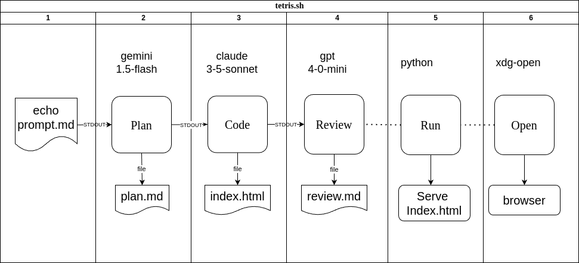

# Sqirvy-AI : Command Line Agents

**VERSION 0.0.1-alpha is under active development and will change frequently** 

## Table of Contents
1.  [What is Sqirvy-AI?](#what-is-sqirvy-ai)
2.  [LLMs Supported](#llms-supported)
3.  [How It Works](#how-it-works)
4.  [Example Pipeline Script](#example-pipeline-script)
5.  [Sqirvy-llm Command Line Program](#sqirvy-ai-command-line-programs)
    *   [Supported Models](#supported-models)
6.  [SDK Library](#sdk-library)
7.  [Examples](#example-usage)
    *   [Build The Executables](#build-the-executables)
    *   [Examples](#examples)
    *   [web/sqirvy-web](#websqirvy-web)
8.  [Clients](#clients)
    *   [Anthropic](#anthropic)
    *   [Gemini](#gemini)
    *   [OpenAI](#openai)
    *   [Llama](#llama)
    *   [DeepSeek](#deepseek)

## What If You Could String Together Some AI Queries To Make Something Happen? And Use A Differet LLM For Each Step? And Do It From The Terminal Instead Of A UI? <a name="what-is-sqirvy-ai"></a>

Imagine you are setting up some DevOps for a project, and you need a simple way to make queries to LLM providers for use in a command line program. You don't want to have to copypasta from a web app or a python script. Or, you want to automate tasks like code review or web scraping using LLMs.

How about this: have a set of simple command line programs that perform various fixed queries to LLM providers. You can use them to automate tasks like code review, testing, and deployment. They could be used in CI/CD pipelines, or as part of a devops workflow. And each step could use a different LLM, whatever was suitable for the options.

What if you could chain multiple queries in a shell command or script, and get a single response? 

In addition, this project includes a simple client SDK in **pkg/sqirvy** that can connect to the supported providers and models and execute a query. This SDK can be used to write your own programs that need to connect to AI's with a very simple query function. For more involved interfacing to AI you would probably want to use LangChain, one of the native AI SDK's or a direct HTTP API. But if you just need your program to provide basic AI support, this SDK makes that easy. The SDK provides two functions, **NewClient** and **QueryText** that can access OpenAI, Gemini, Anthropic, LLama DeepSeek. And just for fun (and example), each client implementation (in pkg/sqirvy) uses a different method to execute queries.

That's what this project is all about.

[GitHub Repo](https://github.com/dmh2000/sqirvy-ai)

## LLMs Supported In This Release <a name="llms-supported"></a>

- https://www.anthropic.com/api
  - claude-3-5-sonnet-latest
  - claude-3-5-haiku-latest
  - claude-3-opus-latest
- https://ai.google.dev/gemini-api/docs
  - gemini-2.0-flash-exp
  - gemini-1.5-flash
  - gemini-1.5-pro
- https://platform.openai.com/docs/overview
  - gpt-4o
  - gpt-4o-mini
  - gpt-4-turbo
  - o1-mini
- https://docs.llama-api.com/quickstart
- llama3.3-70b
- deepseek-r1 (tested with Meta Llama provider)

## How It Works

The main program is **sqirvy**, which is a command line utility that can perform AI queries. **sqirvy** is setup to take prompt input from stdin, perform a query to a specified LLM and send the results to stdout. Because it uses **stdin | sqirvy | stdout**, it is possible to chain together a pipeline, using the same of different models and LLM providers at each step.
In cases where a query needs multiple inputs, it supports taking file names and urls as arguments and combines them as additional context.

<pre>
Usage: bin/sqirvy [-h] [-m model] [-f function] [-t temperature] [files and/or urls  ...]
  -h  print this help message
  -m  AI model to use (default: claude-3.5-sonnet-latest)
  -f  AI function to use (default: query)
    -f query  : execute a generic query
    -f plan   : generate a plan for further action
    -f code   : generate code according to input specifications
    -f review : review code or text
    -f scrape : scrape a URL for text
  -t  Temperature setting for the AI model (0-100, default: 50)
  file1 file2 ...  input files to process
  URLs can be provided as arguments
  data from stdin will be read if there is any
</pre>


## Example Pipeline Script <a name="example-scripts"></a>

THere is an example bash script that illustrates the type of actions you can take with the **sqirvy** program to perform multi-step operations in a pipeline.

### scripts/tetris


```bash
#!/bin/bash

# in scripts/tetris
# this script does the following:
# - creates a directory called tetris
# - echo the design prompt into stdin of sqirvy in plan mode. 
#   - pipe the plan to stdout
# - pipe stdin to sqirvy -f plan and gemini-1.5-flash to create a design for a web app
#   - tee the plan to stdout and to a file
# - pipe stdin to sqirvy -f code and claude-3-5-sonnet-latest to generate code for the design
#   - tee the code to stdout and to a file
# - pipe stin to sqirvy -f review and gpt-4o-mini to review the code
# - starts a web server to serve the generated code

design_prompt="create a design specification for a web project that is a \
    simple web app that implements a simple tetris game clone.       \
    the game should include a game board with a grid, a score display, and a reset button \
    Code should be html, css and javascript, in a single file named index.html. \
    Output will be markdown.  "

export BINDIR=../bin  
make -C ../cmd

rm -rf tetris && mkdir tetris 
echo $design_prompt | \
$BINDIR/sqirvy -m gemini-1.5-flash         -f plan    | tee tetris/plan.md    | \
$BINDIR/sqirvy -m claude-3-5-sonnet-latest -f code    | tee tetris/index.html | \
$BINDIR/sqirvy -m gpt-4o-mini              -f review  >tetris/review.md   

python -m http.server 8080 --directory tetris &

# for Ubuntu. for other platforms just open a browser to this url
xdg-open http://localhost:8080

```

## Sqirvy-llm Command Line Program <a name="sqirvy-ai-command-line-programs"></a>

**bin/sqirvy is primary command line program

### Supported Models

- Supported models:
  - Anthropic
    - claude-3-5-haiku-latest
    - claude-3-5-sonnet-latest
    - claude-3-opus-latest
  - Google Gemini
    - gemini-1.5-flash
    - gemini-1.5-pro
    - gemini-2.0-flash-exp
  - OpenAI
    - gpt-4-turbo
    - gpt-4o
    - gpt-4o-mini
    - o1-mini
  - Meta-Llama
	  - llama3.3-70b
  - DeepSeek
   - deepseek-r1

## SDK Library <a name="sdk-library"></a>

SDK Documentation is in pkg/sqirvy/README.md

The SDK is in directory pkg/sqirvy. It is a very simple interface that allows you to query a provider with a prompt and get a response. It supports Anthropic, Gemini, and OpenAI providers through the 'client' interface. Here is an example of how to use the API in a command line program. Examples for the other providers are in the 'cmd' directory.

- Making a query to a provider
  - Create a new client for the provider you want to use
    - sqirvy.NewClient(sqirvy.<provider>)
    - anthropic, gemini or openai
  - Make the query with a prompt, either from stdin or a file argument, and the model name,
    - client.QueryText(prompt, model string, options Options) (string, error)
  - Get the response
  - Handle any errors

### Here's and example of very simple program that will perform a fixed query, using the NewClient and QueryText functions.
```go
package main

import (
	"fmt"
	"log"

	sqirvy "sqirvy-ai/pkg/sqirvy"
)

func main() {
	// Create a new Anthropic client
	client, err := sqirvy.NewClient(sqirvy.Anthropic)
	if err != nil {
		log.Fatalf("Failed to create client: %v", err)
	}

	// Make the query with a prompt, the model name, and any options (nothing supported yet)
	response, err := client.QueryText("say hello world", "claude-3-5-haiku-lates", sqirvy.Options{})
	if err != nil {
		log.Fatalf("Query failed: %v", err)
	}

	fmt.Println("Response:", response)
}
```

## Examples <a name="example-usage"></a>

Example code is in directory **examples**.  To use them, first build the binaries.
### Build The Executables <a name="build-the-executables"></a>
- the build system uses GNU 'make'
- 'make' can be run from top level or from the cmd or web directories
- build (or default)
  - build the binaries for the cmd and web directories
  - it attempts to build the version for the current OS and CPU Architecture. Has been tested on Ubuntu Linux and Windows 11. Not tested on MacOS x86 or Apple silicon
  - after a `make` or `make test`, the binaries will be in the top level `bin` directory
- test
  - run the tests
- clean
  - remove the binaries an clanup temporary files

### Examples

#### Simple hard coded queries using the specified provider:
-  examples/anthropic
-  examples/gemini
-  examples/llama
-  examples/openai

#### Examples for the various -f <function> flags
- examples/sqirvy-query  : generic chat query
- examples/sqirvy-plan   : generate a plan for an application
- examples/sqirvy-code   : generate code for an application
- examples/sqirvy-review : review existing code
- examples/sqirvy-scrape : scrape a web page and summarize it

#### Example web app
- examples/web : for comparing results of queries from 3 different models

### web/sqirvy-web <a name="websqirvy-web"></a>

A simple web app that allows you to query all three providers in parallel and compare the results.

- cd into "web/sqirvy-web"
- go run .
- it will start a web server on port 8080.


The code for the web app was generated using Aider and the claude-3-5-sonnet-latest model.

## CLients <a name="clients"></a>
### Anthropic <a name="anthropic"></a>

- [Anthropic](https://github.com/anthropics/anthropic-sdk-go)
- this SDK is a Go native client for the Anthropic API
- this SDK is the one recommeded by Anthropic for Go.
- It's in alpha now but seems to work without problems for these use cases.
- Environment Variables Required:
  - export ANTHROPIC_API_KEY=<your api key>

### Gemini <a name="gemini"></a>


- [	Gemini](github.com/google/generative-ai-go/genai)
- this is the official Go client for the Gemini API supported by Google
- **The Gemini SDK requires a "GEMINI_API_KEY" environment variable to authenticate**
- Environment Variables REquired:
  - export GEMINI_API_KEY=<your api key>

### OpenAI <a name="openai"></a>

- [OpenAI](https://platform.openai.com/docs/api-reference)
- Uses OpenAI HTTP API directly
- **The OpenAI API HTTP API requires a "OPENAI_API_KEY" environment variable to authenticate**
- **If you connecting to an OpenAI model to a server besides the official OpenAI servers, you will need to set the "OPENAI_BASE_URL" environment variable to the base URL of the server you are connecting to**
- Environment Variables REquired:
  - export OPENAI_API_KEY=<your api key>
  - export OPENAI_BASE_URL=https://api.openai.com/v1/chat/completions

### Llama <a name="metalama"></a>

- [Meta-LLAMA](github.com/tmc/langchaingo/llms/openai)

### DeepSeek <a name="deepseek"></a>

- [DeepSeek](https://platform.openai.com/docs/api-reference)
- Uses OpenAI HTTP API directly,
- **The API requires a "DEEPSEEK_API_KEY" and "DEEPSEEK_BASE_URL environment variables to authenticate**
- Deepseek was tested using the [LLAMA API Provider](https://console.llamaapi.com/)
